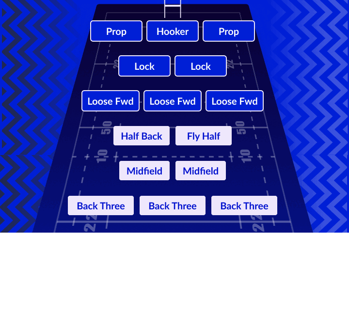
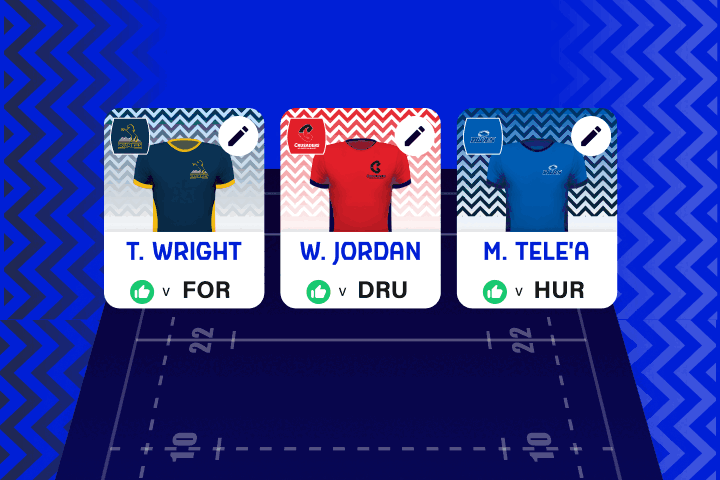
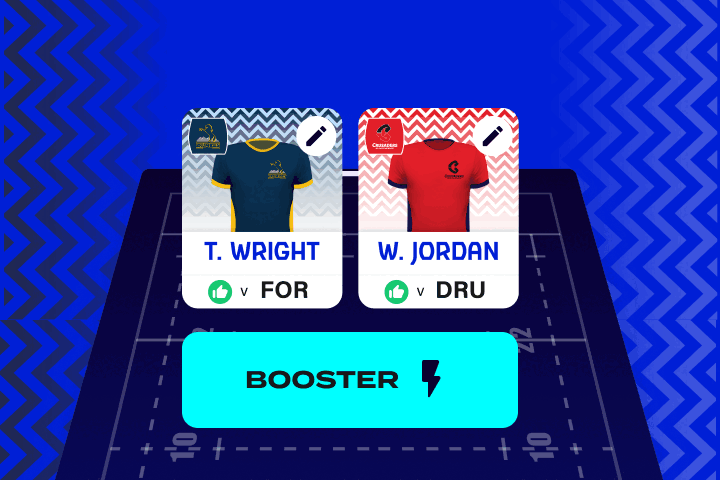
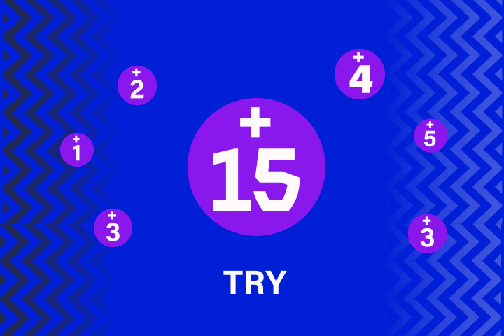
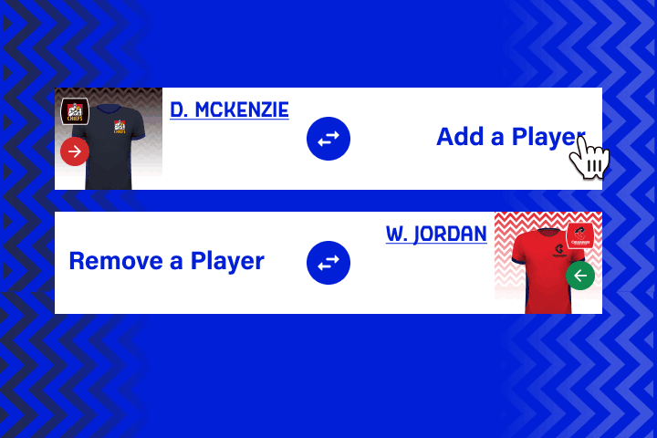
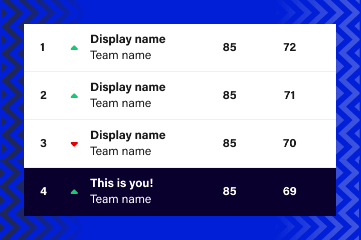
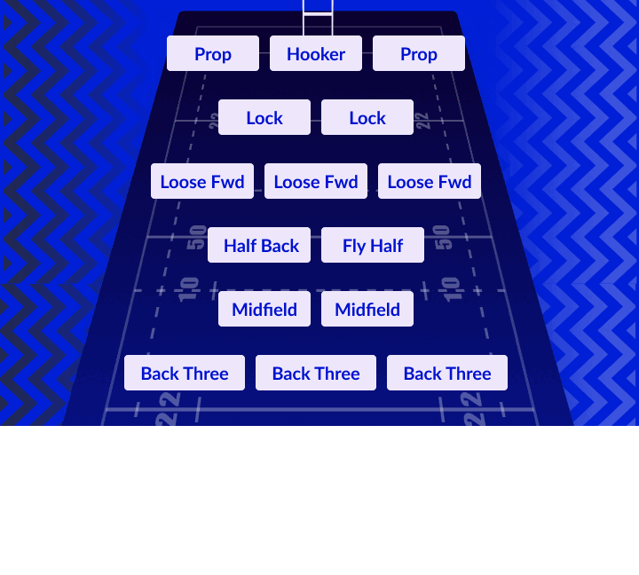

## Build your team

With a budget of $100 million, select your team of 15 players. Tap on a position or a player to open the player pool, then make your selections.

## Choose your Captain

Pick your captain for each round to score double points! Tap on a player to select or swap your captain.

## Boosters
Earn more points and add even more excitement by using your Triple Captain, Limitless and Co-Captains boosters. Use them wisely, as each booster can only be used once throughout the season!

## Score Points
Earn points based on player performances in every game.

## Transfers
Take advantage of unlimited transfers to ensure your team is perfectly set up for every round. Tweak your lineup right up until kick-off of every game throughout the season.

## Compete
Play against friends, family and colleagues in private leagues, as well as in the overall leaderboard to show off your skills to other fans!

--- 

## Rugby Positions Explained
In rugby, each position demands a unique combination of physical and technical skills, and every player has specific responsibilities on the field.

### Forwards
Every rugby team has 8 Forwards. Renowned as the workhorses of the team, Forwards will generally score Fantasy points for scrums, lineouts and defensive actions like making tackles.

### Fly Half
The Fly Half is often the most influential player on the pitch, responsible for orchestrating a team’s attack and defence. Most Fly Halves are also great kickers, scoring Fantasy points for conversions and penalties.

### Half Back
The Half Back is the team's heartbeat - making decisions, linking play, throwing key passes, and kicking accurately. Scrum Halves will often score Fantasy points for offloads, try assists and linebreaks.

### Midfielders
Your Midfielders can play both inside and outside roles. They will score Fantasy points through line breaks and metres gained.

### Back Three
The Back Three are usually among the fastest players in any rugby team. They will be scoring a ton of Fantasy points through tries, linebreaks, try-saving tackles and metres gained!

