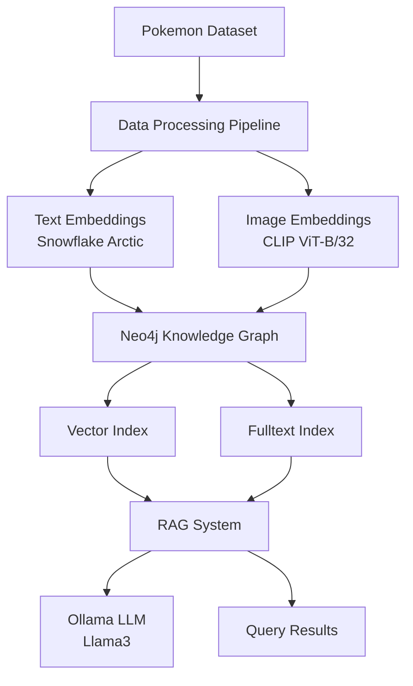

# Pokemon Knowledge Graph & RAG System 🔥

[](https://www.python.org/downloads/)
[](https://neo4j.com/)
[](LICENSE)
[](https://github.com/psf/black)

> A sophisticated knowledge graph system that combines Pokemon data with advanced AI capabilities, featuring multimodal embeddings, graph neural networks, and retrieval-augmented generation (RAG) for intelligent Pokemon information retrieval.

## 🚀 Features

- **🧠 Knowledge Graph**: Neo4j-powered graph database with rich Pokemon relationships
- **🔍 Multimodal Search**: CLIP-based image embeddings for visual similarity search
- **📊 Graph RAG**: Advanced retrieval-augmented generation using graph context
- **🎯 Vector Similarity**: Semantic search using state-of-the-art embeddings
- **🐳 Containerized**: Docker Compose setup for easy deployment
- **📈 Graph Analytics**: Graph Data Science algorithms for Pokemon insights
- **🔗 Rich Relationships**: Complex entity relationships (types, abilities, species, etc.)

## 🏗️ Architecture



## 📋 Prerequisites

- **Python**: 3.10 or higher
- **Docker**: Latest version with Docker Compose
- **Memory**: 8GB+ RAM recommended for optimal performance
- **Storage**: 5GB+ free space for images and graph data

## 🛠️ Installation

### 1. Clone the Repository

```bash
git clone https://github.com/altierispeixoto/pokemon.git
cd pokemon-knowledge-graph
```

### 2. Environment Setup

```bash
# Install UV package manager (recommended)
curl -LsSf https://astral.sh/uv/install.sh | sh

# Install dependencies
uv sync

# Activate virtual environment
source .venv/bin/activate  # Linux/Mac
# or
.venv\Scripts\activate     # Windows
```

### 3. Start Neo4j Database

```bash
# Start Neo4j with Docker Compose
docker-compose up -d

# Verify Neo4j is running
curl http://localhost:7474
```

### 4. Environment Configuration

Create a `.env` file in the project root:

```env
NEO4J_URI=bolt://localhost:7687
NEO4J_USER=neo4j
NEO4J_PASSWORD=xxxx
```

## 🚀 Quick Start

### 1. Data Preprocessing

```bash
# Run the preprocessing notebook
jupyter notebook notebooks/1-preprocess.ipynb
```

This will:
- Clean and process the Pokemon dataset
- Generate text embeddings using Snowflake Arctic
- Extract image embeddings using CLIP
- Save processed data to Parquet format

### 2. Build Knowledge Graph

```bash
# Execute the knowledge graph construction
jupyter notebook notebooks/2-pokemon-knowledgebase.ipynb
```

This creates:
- Pokemon nodes with comprehensive attributes
- Relationship networks (types, abilities, species, etc.)
- Vector and fulltext indexes for efficient querying

### 3. GraphRAG Queries

```bash
# Explore the RAG system
jupyter notebook notebooks/3-graphrag.ipynb
```

Example queries:
- "Find Pokemon similar to Pikachu based on appearance"
- "What are the strongest Electric-type Pokemon?"
- "Show me Pokemon with high attack stats and their evolution chains"

## 💻 Usage Examples

### Basic Pokemon Search

```python
from neo4j import GraphDatabase
from pokemon.features.text import TextProcessor
from pokemon.features.image import ImageProcessor

# Connect to Neo4j
driver = GraphDatabase.driver("bolt://localhost:7687", auth=("neo4j", "auror2025"))

# Text-based similarity search
def find_similar_pokemon_by_description(query_text, limit=5):
    with driver.session() as session:
        result = session.run("""
            CALL db.index.fulltext.queryNodes('fulltext_index', $query) 
            YIELD node, score
            RETURN node.name AS pokemon, score
            ORDER BY score DESC LIMIT $limit
        """, query=query_text, limit=limit)
        return [(record["pokemon"], record["score"]) for record in result]

# Image-based similarity search
def find_similar_pokemon_by_image(pokemon_name, threshold=0.9):
    # Extract embeddings for target Pokemon
    processor = ImageProcessor()
    embeddings = processor.extract_image_embedding(pokemon_name)
    
    with driver.session() as session:
        result = session.run("""
            MATCH (p:Pokemon)
            WHERE p.image_embeddings IS NOT NULL
            WITH p, gds.similarity.cosine(p.image_embeddings, $embeddings) as similarity
            WHERE similarity > $threshold
            RETURN p.name AS pokemon, similarity
            ORDER BY similarity DESC
        """, embeddings=embeddings, threshold=threshold)
        return [(record["pokemon"], record["similarity"]) for record in result]
```

### Advanced Graph Queries

```python
# Find Pokemon evolution chains
def get_evolution_chain(pokemon_name):
    with driver.session() as session:
        result = session.run("""
            MATCH path = (p:Pokemon {name: $name})-[:EVOLVES_TO*0..]->(evolution)
            RETURN [node in nodes(path) | node.name] AS evolution_chain
        """, name=pokemon_name)
        return result.single()["evolution_chain"]

# Analyze type effectiveness
def analyze_type_matchups(type1, type2=None):
    query = """
    MATCH (t1:Type {name: $type1})
    OPTIONAL MATCH (t2:Type {name: $type2})
    MATCH (t1)-[r:EFFECTIVE_AGAINST|WEAK_AGAINST|RESISTANT_TO]->(target:Type)
    RETURN type(r) AS relationship, target.name AS target_type
    """
    # Implementation details...
```

## 📊 Data Schema

### Node Types

- **Pokemon**: Core Pokemon entities with stats and attributes
- **Type**: Pokemon types (Electric, Fire, Water, etc.)
- **Ability**: Pokemon abilities and moves
- **Species**: Pokemon species classifications
- **EggGroup**: Breeding compatibility groups
- **Gender**: Gender classifications

### Relationships

- `HAS_TYPE`: Pokemon → Type
- `HAS_ABILITY`: Pokemon → Ability
- `BELONGS_TO`: Pokemon → Species
- `HAS_GENETIC_TIE`: Pokemon → EggGroup
- `HAS_GENDER`: Pokemon → Gender
- `EVOLVES_TO`: Pokemon → Pokemon (evolution chains)

### Properties

```cypher
// Example Pokemon node
(:Pokemon {
  name: "Pikachu",
  height: 0.4,
  weight: 6.0,
  hp_base: 35,
  attack_base: 55,
  defense_base: 40,
  special_attack_base: 50,
  special_defense_base: 50,
  speed_base: 90,
  description: "When Pikachu meets a new friend...",
  vector_property: [0.1, 0.2, ...], // Text embeddings
  image_embeddings: [0.3, 0.4, ...]  // Image embeddings
})
```

## 🔧 Configuration

### Neo4j Configuration

The system uses several Neo4j plugins and configurations:

```yaml
# docker-compose.yml
environment:
  - NEO4J_PLUGINS=["apoc", "graph-data-science"]
  - NEO4J_dbms_memory_pagecache_size=1G
  - NEO4J_dbms_memory_heap_max__size=1G
  - NEO4J_dbms_security_procedures_unrestricted=apoc.*,gds.*
```

### Embedding Models

- **Text Embeddings**: Snowflake Arctic Embed (via Ollama)
- **Image Embeddings**: OpenAI CLIP ViT-Base-Patch32
- **LLM**: Llama3 (via Ollama)

## 📈 Performance

### Benchmarks

- **Graph Size**: ~1,000 Pokemon nodes, ~10,000 relationships
- **Query Performance**: <100ms for most similarity searches
- **Memory Usage**: ~2GB for full dataset with embeddings
- **Index Performance**: Vector similarity queries in <50ms

### Optimization Tips

1. **Memory**: Increase Neo4j heap size for large datasets
2. **Indexing**: Create appropriate indexes for frequent query patterns
3. **Batch Processing**: Use batch operations for bulk data loading
4. **Connection Pooling**: Implement connection pooling for production use

## 🤝 Contributing

We welcome contributions! Please see our [Contributing Guidelines](CONTRIBUTING.md) for details.

### Development Setup

```bash
# Install development dependencies
uv sync --dev

# Install pre-commit hooks
pre-commit install

# Run tests
pytest tests/

# Format code
black src/
isort src/
```

### Code Quality

- **Linting**: `flake8`, `black`, `isort`
- **Type Checking**: `mypy`
- **Testing**: `pytest` with coverage reporting
- **Documentation**: Comprehensive docstrings and type hints

## 📚 Documentation

- [API Reference](docs/api.md)
- [Architecture Guide](docs/architecture.md)
- [Deployment Guide](docs/deployment.md)
- [Troubleshooting](docs/troubleshooting.md)

## 🐛 Troubleshooting

### Common Issues

**Neo4j Connection Failed**
```bash
# Check if Neo4j is running
docker ps | grep neo4j

# Check logs
docker logs neo4j
```

**Memory Issues**
```bash
# Increase Docker memory allocation
# Update docker-compose.yml memory settings
```

**Missing Images**
```bash
# Verify image directory structure
ls -la data/images/
```

## 📄 License

This project is licensed under the MIT License - see the [LICENSE](LICENSE) file for details.

## 🙏 Acknowledgments

- **Neo4j**: Graph database platform and GraphRAG capabilities
- **OpenAI**: CLIP model for image embeddings
- **Hugging Face**: Transformers library and model hosting
- **Ollama**: Local LLM inference platform
- **Pokemon Database**: Original dataset source

## 📞 Support

- **Issues**: [GitHub Issues](https://github.com/your-username/pokemon-knowledge-graph/issues)
- **Discussions**: [GitHub Discussions](https://github.com/your-username/pokemon-knowledge-graph/discussions)
- **Email**: your-email@domain.com

---

<div align="center">
  <strong>Built with ❤️ for the Pokemon and AI communities</strong>
</div>
